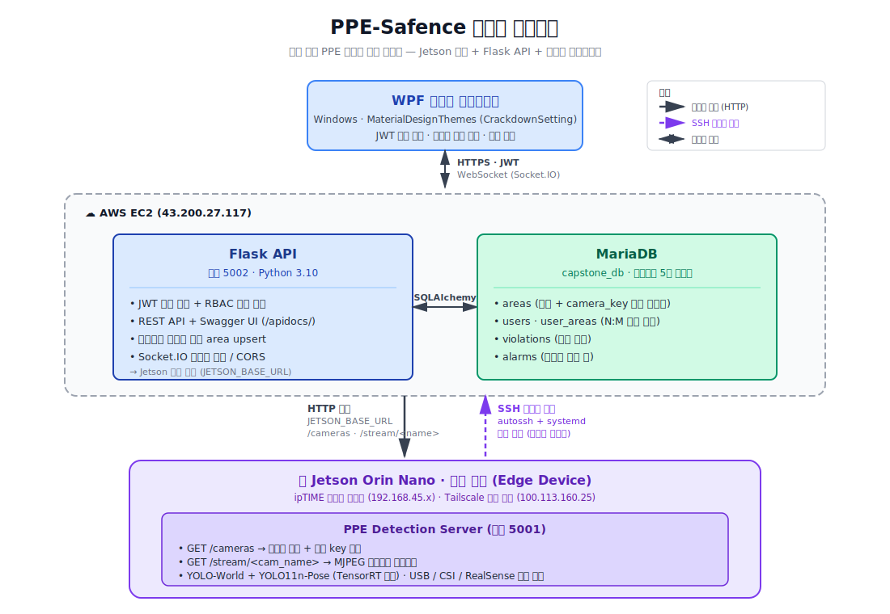

# PPE-Safence API

> 산업 현장 PPE(개인 보호구) 미착용 감지 시스템의 백엔드 API 서버

Jetson Orin Nano 기반의 온디바이스 PPE 감지 단말과 WPF 관리자 클라이언트를 매개하는 Flask 기반 RESTful API. 카메라 ↔ 구역 매핑을 영구 식별자로 관리하고, 위반 알림과 사용자 권한을 정규화된 데이터 모델로 처리합니다.

---

## 목차

- [주요 기능](#주요-기능)
- [기술 스택](#기술-스택)
- [시스템 아키텍처](#시스템-아키텍처)
- [데이터 모델](#데이터-모델)
- [권한 모델](#권한-모델)
- [API 명세](#api-명세)
- [설치 및 실행](#설치-및-실행)
- [환경 변수](#환경-변수)
- [Jetson 보드 연동](#jetson-보드-연동)

---

## 주요 기능

- **실시간 카메라 매핑** — 보드에서 발견된 카메라를 영구 식별자(`camera_key`)로 추적해 USB 포트 변경에도 구역 매핑이 깨지지 않음
- **블루투스 페어링 패턴** — 같은 카메라를 다시 등록하면 기존 행 자동 재활성화 (404 → 부활)
- **다중 구역 권한** — 사용자별 N:M 매핑으로 "전체 / 단일 / 다중 구역" 모드 모두 지원
- **자동 복구 통신** — 보드 ↔ AWS SSH 리버스 터널이 autossh + systemd로 영구 자동 복구
- **JWT 기반 인증** — 토큰 페이로드에 권한 정보 포함, 매 요청마다 DB 조회 불필요
- **Swagger UI 자동 문서화** — `/apidocs/`에서 모든 엔드포인트 즉시 테스트 가능

---

## 기술 스택

| 영역 | 사용 기술 |
|---|---|
| 언어/프레임워크 | Python 3.10, Flask, Flask-SocketIO |
| ORM | SQLAlchemy (Flask-SQLAlchemy) |
| 데이터베이스 | MariaDB 10.11 |
| 인증 | JWT (PyJWT) + Werkzeug bcrypt |
| API 문서 | Flasgger (Swagger 2.0) |
| CORS / WebSocket | Flask-CORS, Flask-SocketIO |
| 외부 통신 | requests (Jetson 보드 호출) |
| 인프라 | AWS EC2, Tailscale (백업 경로), autossh + systemd |

---

## 시스템 아키텍처



**Jetson 보드 도달 경로 (3가지)**:
- **AWS 외부 IP** (default) — `http://43.200.27.117:5001`
  보드 → AWS SSH 리버스 터널 (autossh로 자동 복구) → AWS GatewayPorts로 외부 노출
- **Tailscale** — `http://100.113.160.25:5001`
  메시 VPN. 가입 디바이스 간 직접 통신
- **같은 LAN** — `http://192.168.45.86:5001`
  보드의 사설 IP (개발 환경)

---

## 데이터 모델

### ERD

```
┌──────────────┐      ┌─────────────┐      ┌────────────── ──┐
│   users      │      │  user_areas │      │     areas       │
├──────────────┤      ├─────────────┤      ├─────────────────┤
│ id (PK)      │ ◄──┐ │ user_id (PK)│ ┌──► │ area_id (PK)    │
│ login_id     │    │ │ area_id (PK)│ │    │ area_name (UQ)  │
│ password     │    └─┤ created_at  ├─┘    │ area_code (UQ)  │
│ name         │      └─────────────┘      │ camera_key (UQ) │
│ role         │                           │ description     │
└──────────────┘                           │ risk_level      │
                                           │ is_active       │
                                           │ created_at      │
                                           │ updated_at      │
                                           └────────────── ──┘
                                                   ▲
                                                   │ FK (area_id)
                                                   │
                                ┌──────────────────┼──────────────────┐
                                │                                     │
                       ┌────────────────┐                  ┌─────────────────┐
                       │   violations   │                  │      alarms     │
                       ├────────────────┤                  ├─────────────────┤
                       │ id (PK)        │                  │ id (PK, str)    │
                       │ violation_type │                  │ type            │
                       │ detected_at    │                  │ time            │
                       │ area_id (FK)   │                  │ area_id (FK)    │
                       │ image_path     │                  │ status          │
                       │ is_checked     │                  │ image_url       │
                       └────────────────┘                  └─────────────────┘
```

### 테이블 설명

| 테이블 | 역할 |
|---|---|
| `areas` | 구역과 카메라 매핑. `camera_key`(영구 식별자, UNIQUE)로 USB 포트 변경에도 안정 |
| `users` | 시스템 사용자. 단일 컬럼 zone 대신 `user_areas` 조인으로 다중 구역 매니저 표현 |
| `user_areas` | User × Area N:M 매핑. 행이 없으면 "전체 권한"으로 해석 |
| `violations` | PPE 미착용 등 위반 이력. 구역 정보는 `area_id` FK |
| `alarms` | 사용자에게 보이는 위반 알림. 구역 정보는 `area_id` FK |

---

## 권한 모델

`role`과 `user_areas` 매핑 조합으로 4가지 접근 권한 모드가 발생합니다.

| 모드 | 조건 | 알람·구역 조회 범위 |
|---|---|---|
| 슈퍼유저 | `role = '최고 관리자'` | 전체 (`user_areas`와 무관) |
| 전체 매니저 | `role` 매니저급 + `user_areas` 비어있음 | 전체 |
| 단일 구역 매니저 | `user_areas`에 1건 매핑 | 그 구역만 |
| 다중 구역 매니저 | `user_areas`에 N건 매핑 | 매핑된 N개 구역 |

`User.has_global_access()` 메서드 또는 토큰의 `area_ids` 배열로 판단합니다. JWT 토큰 페이로드 예시:

```json
{
  "user": "a002",
  "role": "구역 매니저",
  "area_ids": [1, 2],
  "iat": 1735000000,
  "exp": 1735086400
}
```

---

## API 명세

전체 명세는 서버 실행 후 `http://<host>:5002/apidocs/`에서 확인 가능합니다.

### Auth

| 메서드 | 경로 | 설명 | 권한 |
|---|---|---|---|
| `POST` | `/api/register` | 사용자 등록 (`area_ids` 배열) | - |
| `POST` | `/api/login` | JWT 토큰 발급 | - |
| `PUT` | `/api/users/<id>` | 사용자 정보 수정 (`area_ids` 포함) | 최고 관리자, 보안 팀장 |
| `DELETE` | `/api/users/<id>` | 사용자 삭제 | 최고 관리자, 보안 팀장 |

### Area

| 메서드 | 경로 | 설명 | 권한 |
|---|---|---|---|
| `POST` | `/api/areas` | 구역 생성/재등록 (블루투스 페어링 패턴 upsert) | 최고 관리자, 보안 팀장, 구역 매니저 |
| `GET` | `/api/areas` | 구역 목록 (`?include_inactive=true` 옵션) | 인증된 사용자 |
| `PUT` | `/api/areas/<id>` | 구역 정보 수정 | 최고 관리자, 보안 팀장, 구역 매니저 |
| `DELETE` | `/api/areas/<id>` | 구역 비활성화 (`?hard=true` 시 영구 삭제) | 최고 관리자, 보안 팀장, 구역 매니저 |

### Camera / Stream

| 메서드 | 경로 | 설명 | 권한 |
|---|---|---|---|
| `GET` | `/api/stream-urls` | 활성 카메라 + 구역 매핑 + 오프라인 구역 | 인증된 사용자 |

응답 구조:
- `cameras[]` — 보드에서 잡힌 카메라 (`area`가 객체면 매핑 완료, `null`이면 미등록)
- `offline_areas[]` — DB에 등록은 됐지만 카메라가 안 잡힌 구역
- `online_count` / `offline_count` — UI 카운터용

### Alarms / Stats

| 메서드 | 경로 | 설명 | 권한 |
|---|---|---|---|
| `GET` | `/api/alarms` | 위반 알림 목록 (토큰 `area_ids` 기반 필터) | 인증된 사용자 |
| `GET` | `/api/stats` | 위반 통계 (오늘 / 전체) | 인증된 사용자 |

---

## 설치 및 실행

### 사전 요구사항

- Python 3.10+
- MariaDB 10.11+ (로컬 또는 AWS)
- Jetson 보드 (또는 호환 PPE Detection 서버)

### 1. 의존성 설치

```bash
pip install flask flask-sqlalchemy flask-cors flask-socketio flasgger pymysql pyjwt werkzeug requests
```

### 2. DB 스키마 초기화

MariaDB에 `capstone_db` 생성 후, 다음 4개 테이블을 만듭니다 (전체 DDL은 별도 마이그레이션 스크립트 또는 SQLAlchemy `db.create_all()`로 생성).

- `areas`
- `users`
- `user_areas` (조인 테이블)
- `violations`
- `alarms`

각 테이블은 [데이터 모델](#데이터-모델) 섹션 참조.

### 3. 환경 변수 설정

```bash
# 보드 카메라 서버 주소 (default = AWS 외부 IP)
export JETSON_BASE_URL=http://43.200.27.117:5001
```

또는 PowerShell:
```powershell
$env:JETSON_BASE_URL = "http://43.200.27.117:5001"
```

### 4. 서버 실행

```bash
python app.py
```

서버는 **포트 5002**에서 기동됩니다 (교내 내부망 5000 포트 차단 이슈 회피).

- API: `http://localhost:5002`
- Swagger UI: `http://localhost:5002/apidocs/`

---

## 환경 변수

| 변수명 | 기본값 | 설명 |
|---|---|---|
| `JETSON_BASE_URL` | `http://43.200.27.117:5001` | Jetson 보드 카메라 서버 주소 |

### 환경별 권장 설정

| 환경 | `JETSON_BASE_URL` 값 | 비고 |
|---|---|---|
| AWS 배포 (SSH 리버스 터널) | `http://43.200.27.117:5001` (default) | 외부 누구나 접근 가능 |
| 로컬 PC, 다른 네트워크 | `http://43.200.27.117:5001` (default) | 위와 동일 |
| 로컬 PC, Tailscale 가입 | `http://100.113.160.25:5001` | 가상 사설망 |
| 로컬 PC, 같은 LAN (ipTIME) | `http://192.168.45.86:5001` | 보드 사설 IP 직접 |

---

## Jetson 보드 연동

### 보드 측 요구사항

보드의 PPE Detection 서버는 다음 두 엔드포인트를 제공해야 합니다:

```
GET /cameras
→ {
    "cameras": [
      {"name": "CAM0(USB0)", "key": "USB_2304_4922_PORT_1-2.1"}
    ]
  }

GET /stream/<cam_name>
→ multipart MJPEG 스트림
```

`key`는 카메라의 영구 식별자입니다. USB 카메라는 `vid:pid:serial` 또는 `vid:pid:port_path`, RealSense는 시리얼 넘버, CSI는 sensor-id 기반.

### SSH 리버스 터널 자동 복구

보드가 AWS 뒤에 있을 때 외부에서 접근하려면 보드 → AWS SSH 리버스 터널이 필요합니다. autossh + systemd로 자동 복구되도록 보드에서 설정합니다.

```ini
# /etc/systemd/system/ppe-tunnel.service
[Unit]
Description=PPE Stream SSH Reverse Tunnel to AWS
After=network-online.target ppe-stream.service
Wants=network-online.target

[Service]
Type=simple
User=nana1124
Environment="AUTOSSH_GATETIME=0"
ExecStart=/usr/bin/autossh -M 0 -N \
    -o "ServerAliveInterval=30" \
    -o "ServerAliveCountMax=3" \
    -o "ExitOnForwardFailure=yes" \
    -o "StrictHostKeyChecking=accept-new" \
    -i /home/nana1124/.ssh/aws_tunnel \
    -R 5001:localhost:5001 \
    ubuntu@43.200.27.117

Restart=always
RestartSec=10

[Install]
WantedBy=multi-user.target
```

AWS 측에서는 `/etc/ssh/sshd_config`에 `GatewayPorts yes`를 활성화하고 보안 그룹의 인바운드 규칙에 5001 포트를 허용해야 외부에서 접근할 수 있습니다.

---

## 개발 노트

- **포트 5002 사용 이유**: 교내 내부망에서 5000 포트가 차단되어 있어 우회
- **`role='작업자'` 로그인 차단**: 작업자 계정은 시스템에 등록은 되지만 직접 로그인은 불가 (감지 대상이지 운영 주체가 아님)
- **Soft delete 우선**: `is_active=false`로 비활성화하는 것이 기본, 위반/알림 이력 보존
- **블루투스 페어링 패턴**: `POST /api/areas`는 동일한 `camera_key`가 있으면 자동으로 기존 행 갱신·재활성화

---

## License

본 프로젝트는 동의대학교 캡스톤 디자인 과목(`capstone_2601`)의 일환으로 개발되었습니다.