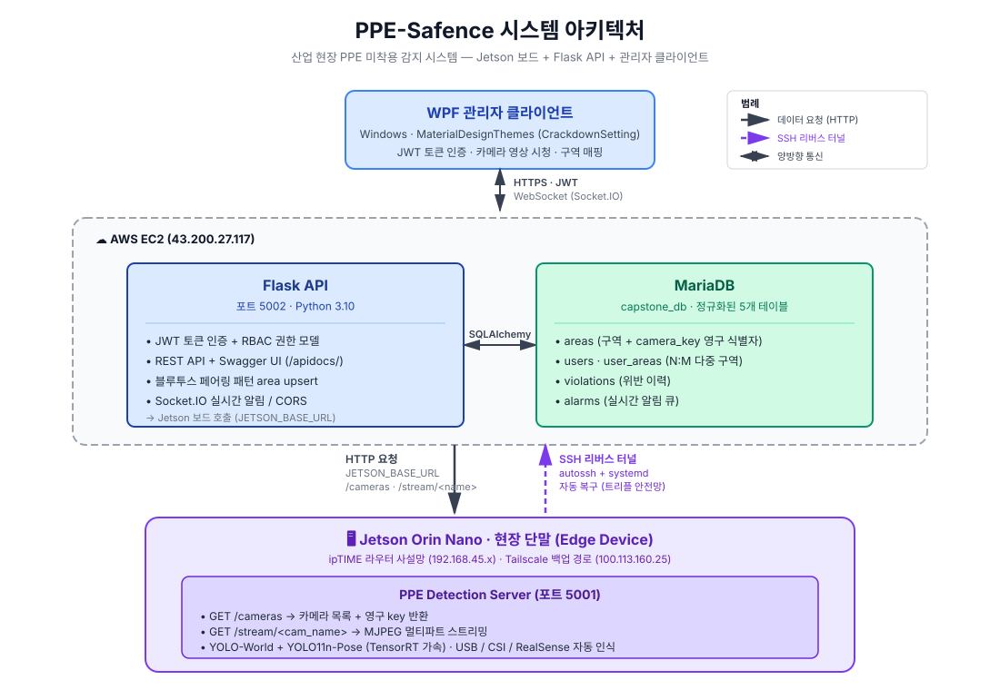

# PPE-Safence API

> 산업 현장 PPE(개인 보호구) 미착용 감지 시스템의 백엔드 API 서버

Jetson Orin Nano 기반의 온디바이스 PPE 감지 단말과 C# WinForms 관제 프로그램을 매개하는 Flask 기반 RESTful API. 카메라 ↔ 구역 매핑을 영구 식별자로 관리하고, 위반 이력과 사용자 권한을 정규화된 데이터 모델로 처리합니다.

---

## 목차

- [주요 기능](#주요-기능)
- [기술 스택](#기술-스택)
- [시스템 아키텍처](#시스템-아키텍처)
- [데이터 모델](#데이터-모델)
- [권한 모델](#권한-모델)
- [API 명세](#api-명세)
- [설치 및 실행](#설치-및-실행)
- [환경 변수](#환경-변수)
- [Jetson 보드 연동](#jetson-보드-연동)

---

## 주요 기능

- **실시간 카메라 매핑** — 보드에서 발견된 카메라를 영구 식별자(`camera_key`)로 추적해 USB 포트 변경에도 구역 매핑이 깨지지 않음
- **블루투스 페어링 패턴** — 같은 카메라를 다시 등록하면 기존 행 자동 재활성화 (404 → 부활)
- **역할 기반 접근 제어** — `role`에 따라 접근 권한을 구분, `작업자` 계정은 로그인 차단
- **위반 이미지 직접 저장** — 위반 캡처 이미지를 `MEDIUMBLOB`으로 DB에 저장, 별도 파일 서버 불필요
- **자동 복구 통신** — 보드 ↔ AWS SSH 리버스 터널이 autossh + systemd로 영구 자동 복구
- **JWT 기반 인증** — 토큰 페이로드에 `role` 포함, 매 요청마다 DB 조회 불필요
- **Swagger UI 자동 문서화** — `/apidocs/`에서 모든 엔드포인트 즉시 테스트 가능

---

## 기술 스택

| 영역 | 사용 기술 |
|---|---|
| 언어/프레임워크 | Python 3.10, Flask, Flask-SocketIO |
| ORM | SQLAlchemy (Flask-SQLAlchemy), pymysql |
| 데이터베이스 | MariaDB (AWS EC2) |
| 인증 | JWT (PyJWT) + Werkzeug 비밀번호 해시 |
| API 문서 | Flasgger (Swagger 2.0) |
| CORS / WebSocket | Flask-CORS, Flask-SocketIO |
| 외부 통신 | requests (Jetson 보드 호출) |
| 이미지 저장 | MySQL `MEDIUMBLOB` |
| 인프라 | AWS EC2, Tailscale (백업 경로), autossh + systemd |

---

## 시스템 아키텍처



**Jetson 보드 도달 경로 (3가지)**:
- **AWS 외부 IP** (default) — `http://43.200.27.117:5001`
  보드 → AWS SSH 리버스 터널 (autossh로 자동 복구) → AWS GatewayPorts로 외부 노출
- **Tailscale** — `http://100.113.160.25:5001`
  메시 VPN. 가입 디바이스 간 직접 통신
- **같은 LAN** — `http://192.168.45.86:5001`
  보드의 사설 IP (개발 환경)

API 서버는 AWS EC2에서 포트 `5002`로 동작하며, MariaDB도 동일 EC2 환경에 둡니다.

---

## 데이터 모델

### ERD

```
┌──────────────┐              ┌─────────────────┐
│   users      │              │     areas       │
├──────────────┤              ├─────────────────┤
│ id (PK)      │◄──┐          │ area_id (PK)    │
│ login_id (UQ)│   │          │ area_name (UQ)  │
│ password     │   │          │ camera_key (UQ) │
│ name         │   │          │ description     │
│ role         │   │          │ risk_level      │
│ is_active    │   │          │ is_active       │
└──────────────┘   │          │ created_at      │
                   │          │ updated_at      │
        FK(user_id)│          └────────┬────────┘
                   │                   │ FK(area_id)
          ┌────────┴─────┐    ┌────────┴────────┐
          │    logs      │    │  violations     │
          ├──────────────┤    ├─────────────────┤
          │ id (PK)      │    │ id (PK)         │
          │ log_type     │    │ violation_type  │
          │ timestamp    │    │ detected_at     │
          │ user_id (FK) │    │ area_id (FK)    │
          │ description  │    │ person_id       │
          └──────────────┘    │ image_data      │
                              │ image_mime      │
                              │ enforced_ppe    │
                              │ is_acknowledged │
                              │ acknowledged_at │
                              │ is_checked      │
                              └─────────────────┘
```

### 테이블 설명

| 테이블 | 역할 |
|---|---|
| `areas` | 구역과 카메라 매핑. `camera_key`(영구 식별자, UNIQUE)로 USB 포트 변경에도 안정 |
| `users` | 시스템 사용자. `role`로 권한을 구분 |
| `violations` | PPE 미착용 등 위반 이력. 위반 이미지를 `image_data`(MEDIUMBLOB)로 직접 저장, 구역 정보는 `area_id` FK |
| `logs` | 로그인 등 시스템 동작 이력. 사용자 정보는 `user_id` FK |

> `violations`는 위반 종류·감지 시각·작업자 추적 ID(`person_id`)·단속 항목(`enforced_ppe`)·대응 여부(`is_acknowledged`, `acknowledged_at`)·확인 여부(`is_checked`)를 함께 보관합니다.

---

## 권한 모델

`role` 값으로 접근 권한이 결정됩니다. 사용자–구역 N:M 매핑 없이, 역할 단위로 단순하게 제어합니다.

| 역할 | 접근 범위 |
|---|---|
| 최고 관리자 | 전체 (`User.has_global_access()` → true) |
| 보안 팀장 | 사용자·구역·위반 관리 |
| 구역 매니저 | 구역·위반 관리 |
| 작업자 | **로그인 불가** (감지 대상이지 운영 주체가 아님) |

권한 검사는 `@token_required`(JWT 검증) → `@role_required(...)`(허용 역할 확인) 데코레이터 조합으로 수행합니다. JWT 토큰 페이로드 예시:

```json
{
  "user": "a002",
  "role": "구역 매니저",
  "iat": 1735000000,
  "exp": 1735086400
}
```

---

## API 명세

전체 명세는 서버 실행 후 `http://<host>:5002/apidocs/`에서 확인 가능합니다.

### Auth · Users

| 메서드 | 경로 | 설명 | 권한 |
|---|---|---|---|
| `POST` | `/api/register` | 사용자 등록 | - |
| `POST` | `/api/login` | JWT 토큰 발급 (비활성·작업자 계정 차단, 접속 로그 기록) | - |
| `GET` | `/api/users` | 사용자 목록 | 인증된 사용자 |
| `PUT` | `/api/users/<id>` | 사용자 정보 수정 | 최고 관리자, 보안 팀장 |
| `DELETE` | `/api/users/<id>` | 사용자 삭제 | 최고 관리자, 보안 팀장 |

### Area · PPE 기준

| 메서드 | 경로 | 설명 | 권한 |
|---|---|---|---|
| `POST` | `/api/areas` | 구역 생성/재등록 (블루투스 페어링 패턴 upsert) | 최고 관리자, 보안 팀장, 구역 매니저 |
| `GET` | `/api/areas` | 구역 목록 (`?include_inactive=true` 옵션) | 인증된 사용자 |
| `PUT` | `/api/areas/<id>` | 구역 정보 수정 | 최고 관리자, 보안 팀장, 구역 매니저 |
| `DELETE` | `/api/areas/<id>` | 구역 비활성화 (`?hard=true` 시 영구 삭제) | 최고 관리자, 보안 팀장, 구역 매니저 |
| `GET` | `/api/ppe-standards` | 구역별 PPE 단속 기준 조회 | 인증된 사용자 |
| `POST` | `/api/ppe-standards` | 구역별 PPE 단속 기준 저장 | 인증된 사용자 |
| `GET` | `/api/ppe-zones` | PPE 단속 구역 목록 | 인증된 사용자 |

### Violations

| 메서드 | 경로 | 설명 | 권한 |
|---|---|---|---|
| `GET` | `/api/violations` | 위반 목록 조회 | 인증된 사용자 |
| `PATCH` | `/api/violations/<id>` | 위반 정보 수정 | 인증된 사용자 |
| `PATCH` | `/api/violations/<id>/acknowledge` | 위반 대응(확인) 처리 | 인증된 사용자 |
| `DELETE` | `/api/violations/<id>` | 위반 삭제 | 인증된 사용자 |
| `GET` | `/api/violations/<id>/image` | 위반 이미지(BLOB) 조회 | 인증된 사용자 |
| `GET` | `/api/violations/unack-count` | 미해결 위반 수 | 인증된 사용자 |

### Stats

| 메서드 | 경로 | 설명 | 권한 |
|---|---|---|---|
| `GET` | `/api/analysis/summary` | 총 작업자 수·PPE 준수율·위반 건수 요약 | 인증된 사용자 |
| `GET` | `/api/analysis/chart` | 차트용 통계 데이터 | 인증된 사용자 |

> `analysis/summary`의 PPE 준수율은 위반 1건당 2점 감점, 최소 85%로 산출됩니다.

### Camera / Stream · Logs

| 메서드 | 경로 | 설명 | 권한 |
|---|---|---|---|
| `GET` | `/api/stream-urls` | 활성 카메라 + 구역 매핑 + 오프라인 구역 | 인증된 사용자 |
| `GET` | `/api/proxy-stream/<cam_name>` | Jetson MJPEG 스트림 프록시 | 인증된 사용자 |
| `GET` | `/api/logs` | 시스템 로그(접속 이력) 조회 | 인증된 사용자 |

`stream-urls` 응답 구조:
- `cameras[]` — 보드에서 잡힌 카메라 (`area`가 객체면 매핑 완료, `null`이면 미등록)
- `offline_areas[]` — DB에 등록은 됐지만 카메라가 안 잡힌 구역
- `online_count` / `offline_count` — UI 카운터용

---

## 설치 및 실행

### 사전 요구사항

- Python 3.10+
- MariaDB (로컬 또는 AWS EC2)
- Jetson 보드 (또는 호환 PPE Detection 서버)

### 1. 의존성 설치

```bash
pip install flask flask-sqlalchemy flask-cors flask-socketio flasgger pymysql pyjwt werkzeug requests
```

### 2. DB 스키마 초기화

MariaDB에 `capstone_db` 생성 후, 다음 4개 테이블을 만듭니다 (전체 DDL은 별도 마이그레이션 스크립트 또는 SQLAlchemy `db.create_all()`로 생성).

- `areas`
- `users`
- `violations`
- `logs`

각 테이블은 [데이터 모델](#데이터-모델) 섹션 참조. 초기 운영을 위해 최고 관리자 계정 1개를 `/api/register`로 등록합니다 (비밀번호는 해시로 저장).

### 3. 환경 변수 설정

```bash
# 보드 카메라 서버 주소 (default = AWS 외부 IP)
export JETSON_BASE_URL=http://43.200.27.117:5001
```

또는 PowerShell:
```powershell
$env:JETSON_BASE_URL = "http://43.200.27.117:5001"
```

### 4. 서버 실행

```bash
python app.py
```

서버는 **포트 5002**에서 기동됩니다 (교내 내부망 5000 포트 차단 이슈 회피).

- API: `http://localhost:5002`
- Swagger UI: `http://localhost:5002/apidocs/`

---

## 환경 변수

| 변수명 | 기본값 | 설명 |
|---|---|---|
| `JETSON_BASE_URL` | `http://43.200.27.117:5001` | Jetson 보드 카메라 서버 주소 |

### 환경별 권장 설정

| 환경 | `JETSON_BASE_URL` 값 | 비고 |
|---|---|---|
| AWS 배포 (SSH 리버스 터널) | `http://43.200.27.117:5001` (default) | 외부 누구나 접근 가능 |
| 로컬 PC, 다른 네트워크 | `http://43.200.27.117:5001` (default) | 위와 동일 |
| 로컬 PC, Tailscale 가입 | `http://100.113.160.25:5001` | 가상 사설망 |
| 로컬 PC, 같은 LAN (ipTIME) | `http://192.168.45.86:5001` | 보드 사설 IP 직접 |

---

## Jetson 보드 연동

### 보드 측 요구사항

보드의 PPE Detection 서버는 다음 두 엔드포인트를 제공해야 합니다:

```
GET /cameras
→ {
    "cameras": [
      {"name": "CAM0(USB0)", "key": "USB_2304_4922_PORT_1-2.1"}
    ]
  }

GET /stream/<cam_name>
→ multipart MJPEG 스트림
```

`key`는 카메라의 영구 식별자입니다. USB 카메라는 `vid:pid:serial` 또는 `vid:pid:port_path` 기반.

### SSH 리버스 터널 자동 복구

보드가 AWS 뒤에 있을 때 외부에서 접근하려면 보드 → AWS SSH 리버스 터널이 필요합니다. autossh + systemd로 자동 복구되도록 보드에서 설정합니다.

```ini
# /etc/systemd/system/ppe-tunnel.service
[Unit]
Description=PPE Stream SSH Reverse Tunnel to AWS
After=network-online.target ppe-stream.service
Wants=network-online.target

[Service]
Type=simple
User=nana1124
Environment="AUTOSSH_GATETIME=0"
ExecStart=/usr/bin/autossh -M 0 -N \
    -o "ServerAliveInterval=30" \
    -o "ServerAliveCountMax=3" \
    -o "ExitOnForwardFailure=yes" \
    -o "StrictHostKeyChecking=accept-new" \
    -i /home/nana1124/.ssh/aws_tunnel \
    -R 5001:localhost:5001 \
    ubuntu@43.200.27.117

Restart=always
RestartSec=10

[Install]
WantedBy=multi-user.target
```

AWS 측에서는 `/etc/ssh/sshd_config`에 `GatewayPorts yes`를 활성화하고 보안 그룹의 인바운드 규칙에 5001 포트를 허용해야 외부에서 접근할 수 있습니다.

---

## 개발 노트

- **포트 5002 사용 이유**: 교내 내부망에서 5000 포트가 차단되어 있어 우회
- **`role='작업자'` 로그인 차단**: 작업자 계정은 시스템에 등록은 되지만 직접 로그인은 불가 (감지 대상이지 운영 주체가 아님)
- **Soft delete 우선**: `is_active=false`로 비활성화하는 것이 기본, 위반·로그 이력 보존
- **블루투스 페어링 패턴**: `POST /api/areas`는 동일한 `camera_key`가 있으면 자동으로 기존 행 갱신·재활성화
- **위반 이미지 BLOB 저장**: 위반 캡처를 `image_data`(MEDIUMBLOB)로 DB에 직접 저장하고, `/api/violations/<id>/image`로 제공
- **보안 주의**: 현재 JWT 시크릿이 코드에 하드코딩되어 있습니다. 공개 배포 시 환경 변수로 분리하고 값을 교체하는 것을 권장합니다.

---

## License

본 프로젝트는 동의대학교 캡스톤 디자인 과목(`capstone_2601`)의 일환으로 개발되었습니다.